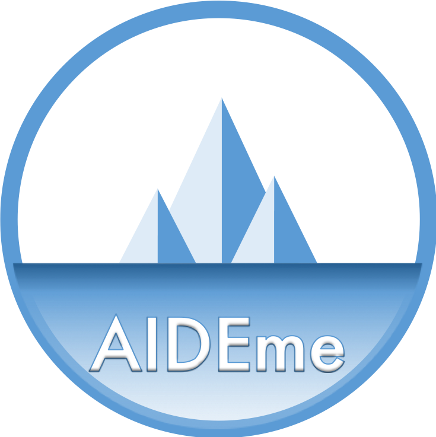

# Website for our project AIDEme 

**AIDEme** is a scalable interactive data exploration system for efficiently learning a user interest pattern over a large dataset.

**Project Members**

- [Yanlei Diao](http://www.lix.polytechnique.fr/~yanlei.diao/)
- [Anna Liu](https://people.math.umass.edu/~anna/)
- [Enhui Huang](https://enhui-huang.github.io/)
- [Luciano Di Palma](https://lucianodp.netlify.com/)
- Bastien van Delft
- Laurent Cetinsoy

**Publications** 

- Huang, E., Peng, L., Di Palma, L., Abdelka, A., Liu, A. & Diao, Y. _Optimization for active learning-based interactive database exploration_. Proceedings of the VLDB Endowment (PVLDB), 12(1), 71-84, September 2018.
- Di Palma, L., Diao, Y. & Liu, A. _A Factorized Version Space Algorithm for Human-In-the-Loop" Data Exploration_. IEEE International Conference on Data Mining (ICDM), November 2019.
- Huang, E., Di Palma, L., Cetinsoy, L., Diao, Y. & Liu, A. _AIDEme: An active learning based system for interactive exploration of large datasets_. Conference on Neural Information Processing Systems (NeurIPS, Demo), December 2019.

## License

Copyright 2018-present [Enhui Huang](https://enhui-huang.github.io/).

<!--Released under the [MIT](https://github.com/sourcethemes/academic-kickstart/blob/master/LICENSE.md) license.-->

<!---->
